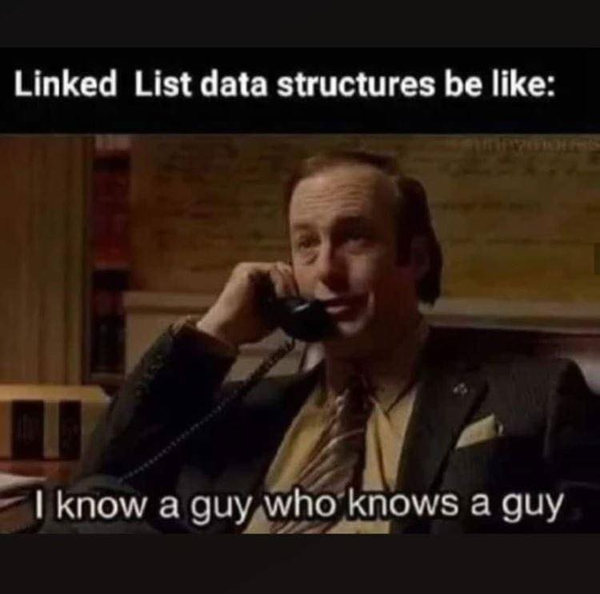

# Daniil Magaril's Github Page

## This is a heading - 2
### This is an even smaller heading

There is a possibility to create **bold text** and *italicized text* and even ~~struck through~~.

Sometimes, people say things
> And so we quote them on their words

Other times, programmers program things,
'''
so we also quote their words;
and their mistakes;
mostly their mistakes;
'''

[Here is a link to the README from Part 2](./README.md)

Here's a list
0. One fish
1. Two fish
   1. When you're in CS so you use zero based indexing by the math profs want one based indexing

And another list!
- Red Fish
- Blue fish
  - Why are there so many types of fish out there???

~~(God I miss Geisel library @Dr. Seuss)~~

Some more things to do:
- [ ] Add some real content
- [ ] Add images
- [X] \*ADD IGNORING MARKDOWN THINGIES\*
- [X] Add emojis :bangbang:

Here's a meme from [Google Images](https://images.google.com) 

