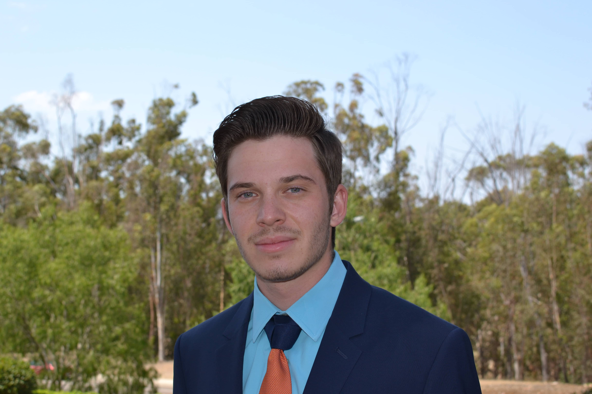

# Daniil Magaril's Github Page



## Early childhood and Personal Life

I was born in **St. Petersburg, Russia** ~~in August of 2000~~, where I lived for the first 7 years of my life. In *2007* I moved to the San Diego, where I have lived ever since.
I have picked up numerous sports throughout my life, including:

- Fencing
- Karate
- Soccer

I have been tinkering with software since middle school, where I started out with Lego Mindstorms and have progressed to Arduinos and Raspberry Pi's. I consider my life motto to be
> What I do today sets me up for what I *can* do tomorrow

## Education

I currently attend UC San Diego, where I am working towards a Bachelor of Science in `Computer Science` with a minor in Cognitive Science :brain:
Since CS involves a lot of coding, I have chosen to include a for loop which does `nothing`:

```
for i in range(5):
  nothing()

'''

## Work experience and Future Plans

I have been employed at my [fencing studio](https://www.teamtouche.com) as a \*Head Junior Coach\* and currently work as an Administrator for a Salesforce Consulting Partner.

Throughout my career I hope to:
- [X] Work on a self-set schedule
- [ ] Work in a Fortune 500 Company
- [ ] Work on a autonomous-driving project


To visit a meme I found funny, click [here](./meme.png)